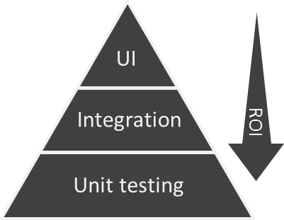

# 概要
フロントサイドのテストに関して調査

# テストレベル
## ユニットテスト(Unit testing)
小さなプログラムを「単体」でテストする手法をいわゆるユニットテストと呼びます。

ユニットテストは、基本的には100%に近いカバレッジで実装されることが望ましいです。
最も実装/実行コストが少ないですし、書けばとりあえずメリットを出しやすいのがこのテストです。

## 結合テスト(Integration)
いくつかのクラスや関数を組み合わせ、意味のある塊をテストする手法のこと。

このとき、使用するクラスのロジックについては気にしないことがポイント。
例えば、「FacadeパターンやProxyパターンの実装の入出力だけをテストしたい」などが対象として思い浮かびます。

## システムテスト(UI)
すべての要素(例えばバックエンドとの通信・ハードウェアなども)をつなぎ合わせてテストすること。
実環境で実施するテストのこと。

## リグレッションテスト
動作を担保するために実装するテストのこと。
複雑なロジックがないコードでも、仕様を担保し、予期せぬ変更がないことを保証するために実装する。

## ビジュアルリグレッションテスト
見た目をテストすること。
スタイルに関してテストでカバーすることができる。

# 具体例
## ユニットテスト(Unit testing)
`src/functions.test.ts`とか？

`yarn test`で実行可能。

## 結合テスト(Integration)
`src/Pages/Todos/index.test.ts`とか？
`yarn test`で実行可能。

## システムテスト(UI)
E2Eテストによるシステムテストを実施。
cypressで実行可能。

```bash
yarn start # Launch DevServer
yarn cypress:open
```


## リグレッションテスト
何をすればリグレッションテストしたと言える？
「ユニットテスト・統合テスト・システムテスト」全て実施することがリグレッションテストと言える？

## ビジュアルリグレッションテスト
[storybook](https://storybook.js.org/) + [storycap](https://github.com/reg-viz/storycap) + [reg-suit](https://github.com/reg-viz/reg-suit)
- storybookでコンポーネントのカタログを作成
- storycapでstorybookをクロールしスクリーンショットをキャプチャする
- キャプチャ画像より、reg-suitでビジュアルテストを行う
[サンプルReport](https://reg-publish-bucket-63b30113-4470-483f-bd0d-d7f7b99e7f4d.s3.amazonaws.com/409c82db64a45e40a254ed2b59ed375ca2ac74e5/index.html)

# テストピラミッド

各レイヤーで実行するテスト量を示し、またテストにかける工数の目安とも言えます。
そして、どのテストを充実させたらいいのかなどの判断の参考にもなるものです。
ピラミッドの上にいくほど、
- ユーザーと同じようになっている
- テストの実行速度が遅い
- 開発者の方へのフィードバックに時間がかかる
- 脆い
- 高コスト

ピラミッドの下にいくほど
- 局所的
- テストの実行速度が早い
- 開発者の方へのフィードバックも早い
- 堅牢
- 低コスト

自動テストを作る時には、このピラミッドの形になるようにするのが良い。
各レイヤーのテストの割合は、一般的には、以下の割合で作成すると良い。
Unit testing : 70%
Integration : 20%
UI : 10%

テスト自動化を行う場合は、以下のことを考えると良い。
- 新しいテストを追加するときには、まずUnit testingで対応できないか確認します。
- テストは、常にピラミッドのなるべく下のレイヤーに入れるようにします。
- ピラミッドのすべてのレイヤーにおいて、チームメンバーと協力して、無駄や重複を避けます。

# 参照
- サンプルコード
  - [Create React App TypeScript Todo Example 2020](https://github.com/laststance/create-react-app-typescript-todo-example-2020)
- テストについて
  - [フロントエンドのテストについて考える](https://qiita.com/okmttdhr/items/c1e80353928e121c4761)
  - [ビジュアルレグレッションテストとは](https://engineering.linecorp.com/ja/blog/visual-regression-otoshidama/)
  - [The Forgotten Layer of the Test Automation Pyramid](https://www.mountaingoatsoftware.com/blog/the-forgotten-layer-of-the-test-automation-pyramid)
  - [テストのピラミッドを開発者と一緒に眺めてみよう！](https://dev.classmethod.jp/articles/testing_pyramid/)
  - [テストの基礎](https://developer.android.com/training/testing/fundamentals?hl=ja)